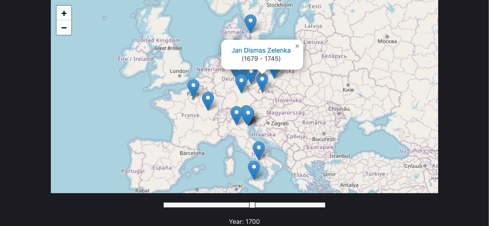

# mugeochr

## Visualise music composers through the years, on a map



```bash
git clone https://github.com/hejops/mugeochr
cd mugeochr
pnpm install
pnpm vite
```

No network is required after the initial data dump (JSON).
I would prefer to have implemented some kind of SQLite/Wasm solution, but was
too lazy to do it.

(It's supposed to rhyme with "mediocre".)
